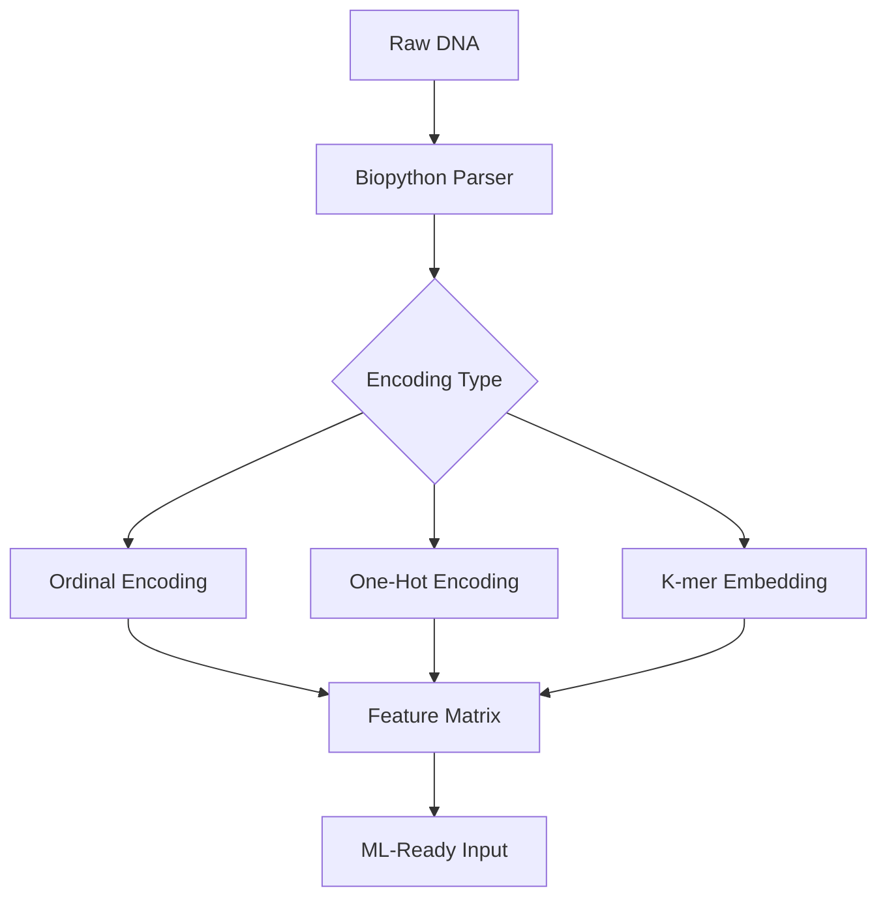

# 🧬 GeneDecodeAI: A Modular Pipeline for DNA Sequence Encoding in Machine Learning

**Author:** *Poojitha*  
**Project Type:** Research Prototype / Bioinformatics Pipeline  
**Status:** Experimental

---

## 🧩 Abstract

Understanding biological sequences such as DNA is a cornerstone of modern genomics. However, integrating these symbolic sequences into traditional machine learning pipelines requires rigorous preprocessing and feature engineering. **GeneDecodeAI** presents a modular, extensible pipeline that transforms raw DNA sequences into machine-learning-compatible feature matrices using multiple encoding strategies.

This work demonstrates the viability of preprocessing workflows for supervised learning tasks such as species classification and evolutionary analysis.

---

## 🎯 Research Motivation

Despite the abundance of biological data, its symbolic nature (e.g., nucleotide sequences) hinders direct integration into ML models. This project aims to:

- Evaluate different encoding techniques for DNA sequences
- Create a reproducible data transformation pipeline
- Lay the groundwork for DNA-based classification models

---

## 🔬 Methodology

### 1. **Data Collection**
- DNA sequence files in `.fasta` format were used as input
- The sequences represent different species (e.g., human, chimpanzee, dog)

### 2. **Preprocessing**
- Sequence parsing using **Biopython**
- Removal of non-standard characters
- Option to fix or truncate sequence lengths for uniformity

### 3. **Feature Encoding**

| Encoding Type        | Description                                         |
|----------------------|-----------------------------------------------------|
| **Ordinal Encoding** | Integer encoding of bases (`A=0, T=1, G=2, C=3`)    |
| **One-Hot Encoding** | Binary matrix indicating nucleotide presence        |
| **K-mer Encoding**   | Fixed-length substring embeddings (e.g., 3-mers)    |

Each method generates a different view of the same genetic data for comparative modeling.

---

## 🔄 Pipeline Architecture


*The architecture is modular, enabling easy replacement or extension of encoding stages.*

---

## 📊 Initial Observations

- Different encoding techniques affect feature dimensionality significantly.
- K-mer encoding captures sequence context better than one-hot or ordinal.
- Feature matrices were validated via `.shape` and visual inspection.

**Example Output:**
```python
print(X.shape)         # All samples combined
print(X_chimp.shape)   # Samples from chimpanzee
print(X_dog.shape)     # Samples from dog
```

---

## 🧪 Experiments (Planned)

- Supervised classification using Random Forests and SVMs
- Dimensionality reduction (e.g., PCA) for feature visualization
- Comparative performance analysis of encoding strategies
- Cross-species classification accuracy metrics

---

## ⚙️ Implementation Stack

| Component         | Tools Used                |
|-------------------|--------------------------|
| Language          | Python 3.10              |
| Parsing           | Biopython                |
| Data Processing   | NumPy, Pandas            |
| Feature Encoding  | scikit-learn             |
| Environment       | Jupyter, Docker          |

---

## 💻 Setup Instructions

**Clone and Run**
```bash
git clone https://github.com/Poojitha319/GeneDecodeAI.git
cd GeneDecodeAI
```

**Option 1: Run via Docker**
```bash
docker build -t gene-decode-ai .
docker run -p 8888:8888 gene-decode-ai
```

**Option 2: Run Locally**
```bash
pip install -r requirements.txt
jupyter lab
```

---

## 🔮 Future Work

- Support for protein/RNA encoding
- Integration with deep learning frameworks (e.g., PyTorch, TensorFlow)
- Use of transformer-based sequence embeddings (e.g., DNABERT)
- Comparative benchmarking with real genomics classification datasets

---

## 📂 Directory Structure

```
GeneDecodeAI/
│
├── DNA_sequencing_classification.ipynb   # Main analysis notebook
├── requirements.txt                      # Python dependencies
├── Dockerfile                            # Containerization
├── .github/workflows/                    # GitHub Actions for CI
└── README.md                             # Project overview
```

---

## 📜 License

This work is released for academic and research purposes. Formal licensing to be defined.

---

## 👋 Acknowledgments

Special thanks to open-source tools like Biopython, scikit-learn, and the broader genomics research community for making bioinformatics accessible to ML practitioners
